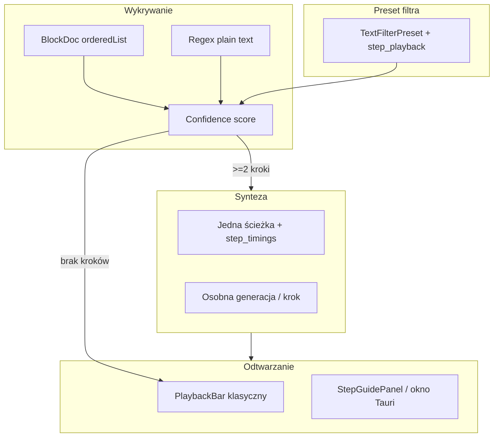
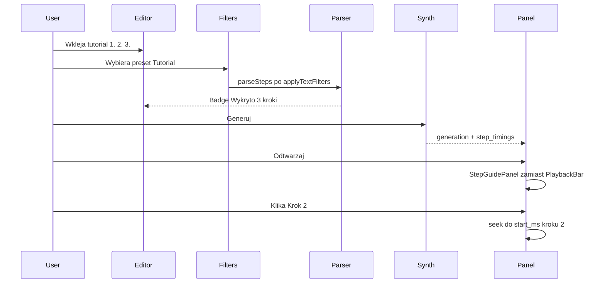

# Plan: filtr odtwarzania „Tryb kroków” (step-by-step tutorial)

<!-- tts-summary -->
Rozszerzę presety filtrów o tryb kroków, który wykrywa listy numerowane i tutoriale w tekście przed syntezą. Przy odtwarzaniu zamiast klasycznego paska pojawi się przeciągalne okienko z klikalnymi krokami, z możliwością minimalizacji i opcjonalnie always-on-top nad Blenderem. Domyślnie jedna ścieżka audio ze znacznikami czasu; opcjonalnie osobna synteza na krok. Praca w trzech fazach: parser i preset, UI odtwarzania, integracja z generacją i Cursorem.
<!-- /tts-summary -->

## Kontekst w kodzie

Obecne „filtry” w TTS Hub to **filtry tekstu przed syntezą** ([`src/lib/textFilters.ts`](c:\Users\user\Documents\VIBELIFE2026\TTS_hub\src\lib\textFilters.ts), [`src-tauri/src/text_filters.rs`](c:\Users\user\Documents\VIBELIFE2026\TTS_hub\src-tauri\src\text_filters.rs)) — nie modyfikują odtwarzania. Odtwarzanie to jeden plik audio w [`PlaybackContext`](c:\Users\user\Documents\VIBELIFE2026\TTS_hub\src\context\PlaybackContext.tsx) + [`PlaybackBar`](c:\Users\user\Documents\VIBELIFE2026\TTS_hub\src\components\PlaybackBar.tsx). Istniejące wzorce do reuse:

- **Segmentacja tekstu:** roleplay [`docToSegments`](c:\Users\user\Documents\VIBELIFE2026\TTS_hub\src\roleplay\segments.ts) + kolejka [`roleplay/queue.rs`](c:\Users\user\Documents\VIBELIFE2026\TTS_hub\src-tauri\src\roleplay\queue.rs)
- **Kolejka odtwarzania:** [`usePlaybackQueue`](c:\Users\user\Documents\VIBELIFE2026\TTS_hub\src\hooks\usePlaybackQueue.ts)
- **Pływające okno:** [`playback-toast`](c:\Users\user\Documents\VIBELIFE2026\TTS_hub\src-tauri\src\playback_toast_window.rs) + [`ToastWindowPanel`](c:\Users\user\Documents\VIBELIFE2026\TTS_hub\src\components\toast\ToastWindowPanel.tsx)
- **Listy w edytorze:** [`blockTransform.ts`](c:\Users\user\Documents\VIBELIFE2026\TTS_hub\src\components\editor\blockTransform.ts) — `orderedList` z `meta.ordered`, ale `listText()` **gubi numerację** przy flatten



---

## 1. Model danych — rozszerzenie presetu filtra

Rozszerzyć [`TextFilterPreset`](c:\Users\user\Documents\VIBELIFE2026\TTS_hub\src\lib\textFiltersTypes.ts) (mirror w Rust [`text_filters.rs`](c:\Users\user\Documents\VIBELIFE2026\TTS_hub\src-tauri\src\text_filters.rs)):

```typescript
export type StepPlaybackMode = "off" | "auto" | "force";

export interface StepPlaybackSettings {
  mode: StepPlaybackMode;           // auto = wykryj; force = zawsze panel (nawet 1 krok)
  min_steps: number;                // domyślnie 2
  synth_per_step: boolean;          // false = jedna ścieżka (MVP); true = osobna synteza
  auto_advance: boolean;            // po ended → następny krok
  pause_between_ms: number;         // pauza między krokami (0–3000)
  show_intro: boolean;              // tekst przed pierwszym krokiem jako „Wstęp”
}

// w TextFilterPreset:
step_playback?: StepPlaybackSettings;
```

Nowy factory preset w [`filterPresetCatalog.ts`](c:\Users\user\Documents\VIBELIFE2026\TTS_hub\src\lib\filterPresetCatalog.ts): **`factory-tutorial-steps`** („Tutorial / kroki”) z `mode: "auto"`, `min_steps: 2`.

Struktura wykrytych kroków (nowy moduł [`src/lib/stepPlayback/parseSteps.ts`](c:\Users\user\Documents\VIBELIFE2026\TTS_hub\src\lib\stepPlayback\parseSteps.ts) + mirror Rust [`text_steps.rs`](c:\Users\user\Documents\VIBELIFE2026\TTS_hub\src-tauri\src\text_steps.rs)):

```typescript
export interface PlaybackStep {
  index: number;          // 1-based display
  label: string;          // skrócony tytuł kroku (np. pierwsze ~60 znaków)
  text: string;           // pełny tekst do syntezy / wyświetlenia
  char_start?: number;    // offset w filtered_text (single-track)
  char_end?: number;
  generation_id?: string; // gdy synth_per_step
}
export interface StepParseResult {
  steps: PlaybackStep[];
  intro?: string;
  confidence: number;     // 0–1
  source: "ordered_list" | "numbered_lines" | "manual";
}
```

---

## 2. Wykrywanie — kiedy włączyć tryb kroków?

### Źródła (kolejność priorytetu)

| Źródło | Warunek | Plik |
|--------|---------|------|
| Block editor | Blok `kind: "list"` + `meta.ordered` + ≥ `min_steps` pozycji | `blockTransform.ts` — nowa `orderedListToSteps()` |
| Plain text | ≥ `min_steps` linii pasujących do wzorców | `parseSteps.ts` |
| Wymuszenie | `step_playback.mode === "force"` | preset |

### Wzorce regex (PL + EN)

- `^\s*\d+[\.\):\-]\s+\S` — `1.`, `2)`, `3 -`
- `^(Krok\|Step\|Punkt\|Etap)\s+\d+[\.\):\-]?\s*` — case-insensitive
- Opcjonalnie faza 2: `- [ ]` / `- [x]` jako kroki checklisty

### Scoring (confidence)

- +0.4 jeśli numeracja sekwencyjna (1,2,3…)
- +0.3 jeśli ≥3 kroki
- +0.2 jeśli spójny format wszystkich linii
- Próg aktywacji: **≥0.6** przy `mode: "auto"`

### Podgląd przed generacją

W [`SynthTextPreview.tsx`](c:\Users\user\Documents\VIBELIFE2026\TTS_hub\src\components\textFilters\SynthTextPreview.tsx) lub obok — badge: **„Wykryto N kroków”** z rozwijaną listą. W [`TextFiltersBar`](c:\Users\user\Documents\VIBELIFE2026\TTS_hub\src\components\textFilters\TextFiltersBar.tsx) — ikona kroków gdy preset ma `step_playback`.

### Fix: numeracja z edytora

W [`listText()`](c:\Users\user\Documents\VIBELIFE2026\TTS_hub\src\components\editor\blockTransform.ts) dla `orderedList` emitować `1. tekst\n2. tekst` — poprawia wykrywanie i spójność TTS.

---

## 3. Synteza — strategia hybrydowa (domyślna)

### Faza A (MVP): jedna ścieżka + znaczniki

1. Po filtrach: `parseSteps(filtered_text)` → `steps[]`
2. Synteza **jednego** `filtered_text` (jak dziś)
3. Po syntezie: obliczyć `char_start`/`char_end` per krok; estymować `start_ms`/`end_ms` proporcjonalnie do `duration_ms` (jak [`HistoryTextPreview`](c:\Users\user\Documents\VIBELIFE2026\TTS_hub\src\components\HistoryTextPreview.tsx) scroll sync)
4. Zapisać w DB: nowe pole JSON `step_timings` na `generations` (migracja w [`db.rs`](c:\Users\user\Documents\VIBELIFE2026\TTS_hub\src-tauri\src\db.rs))

### Faza B: osobna synteza na krok (`synth_per_step: true`)

1. Frontend/backend: `generate_step_batch` — N żądań z `parent_generation_id` + `step_index`
2. Kolejkowanie przez istniejący [`usePlaybackQueue`](c:\Users\user\Documents\VIBELIFE2026\TTS_hub\src\hooks\usePlaybackQueue.ts)
3. Wzorzec jak [`roleplay/queue.rs`](c:\Users\user\Documents\VIBELIFE2026\TTS_hub\src-tauri\src\roleplay\queue.rs) — lekki worker, bez pełnego Roleplay Studio

### Faza C (opcjonalna): dokładne timestampy

- Reuse [`minimax_subtitles.rs`](c:\Users\user\Documents\VIBELIFE2026\TTS_hub\src-tauri\src\minimax_subtitles.rs) do mapowania słów → granice kroków (tylko MiniMax)

---

## 4. UI — okienko kroków zamiast klasycznego odtwarzacza

Gdy aktywna generacja ma `step_timings` (lub powiązane kroki) **i** preset włącza tryb kroków:

- **Ukryć / zwinąć** klasyczny [`PlaybackBar`](c:\Users\user\Documents\VIBELIFE2026\TTS_hub\src\components\PlaybackBar.tsx) do trybu kompaktowego (przycisk „Klasyczny widok”)
- **Pokazać** [`StepGuidePanel`](c:\Users\user\Documents\VIBELIFE2026\TTS_hub\src\components\stepPlayback\StepGuidePanel.tsx)

### StepGuidePanel — funkcje podstawowe

| Funkcja | Implementacja |
|---------|---------------|
| Lista kroków klikalnych | `<button>` per krok → `seek(startMs)` lub `select(stepGeneration)` |
| Aktywny krok | highlight + auto-scroll w liście; sync z `audio.currentTime` |
| Play/pause bieżącego | delegacja do `PlaybackContext` |
| Auto-advance | `audio ended` → następny krok (z `pause_between_ms`) |
| Minimalizacja | collapse do paska „Krok 3/7” + play |
| Przeciąganie | `useDraggablePanel` (nowy hook) — `position: fixed`, zapis w `localStorage` |
| Zamknięcie | powrót do klasycznego PlaybackBar |

### Okno Tauri always-on-top (nad Blenderem)

Wzorzec 1:1 z [`playback_toast_window.rs`](c:\Users\user\Documents\VIBELIFE2026\TTS_hub\src-tauri\src\playback_toast_window.rs):

- Nowe okno `step-guide` w [`tauri.conf.json`](c:\Users\user\Documents\VIBELIFE2026\TTS_hub\src-tauri\tauri.conf.json): ~360×480, `transparent`, `alwaysOnTop`, `decorations: false`, **resizable: true**
- Boot w [`main.tsx`](c:\Users\user\Documents\VIBELIFE2026\TTS_hub\src\main.tsx) → `StepGuideApp`
- Bridge jak [`playbackToastContract.ts`](c:\Users\user\Documents\VIBELIFE2026\TTS_hub\src\lib\playbackToastContract.ts): `step-guide:state`, `step-guide:action`
- Przycisk w panelu: **„Okno nad aplikacjami”** — `show_step_guide_window` / `hide`

### Dodatkowe sugestie UX (faza 2–3)

- **Skróty klawiszowe:** `1`–`9` = krok, `Space` = play/pause, `]` = następny krok
- **Checkbox „zrobione”** per krok (stan w `localStorage` per `generation_id`)
- **Kopiuj tekst kroku** do schowka (przydatne w Blenderze)
- **Powtórz krok** — replay tylko bieżącego segmentu
- **Znaczniki na waveformie** — pionowe linie w [`WaveformPlayer`](c:\Users\user\Documents\VIBELIFE2026\TTS_hub\src\components\WaveformPlayer.tsx) przy granicach kroków
- **Pin / always on top** toggle w panelu (bez osobnego okna Tauri)
- **Dock** do lewej/prawej krawędzi main window
- **Eksport checklisty** — markdown `- [ ] krok` z historii
- **Integracja Cursor:** w [`cursor-tts.ps1`](c:\Users\user\Documents\VIBELIFE2026\TTS_hub\.cursor-hooks\cursor-tts.ps1) — `Detect-Steps` przed `/generate`; opcjonalnie `step_timings` w metadata odpowiedzi HTTP
- **Powiadomienie** gdy krok się kończy (toast „Krok 2 zakończony — kliknij 3”)

---

## 5. Przepływ użytkownika



---

## 6. Pliki do utworzenia / zmiany

### Nowe

| Plik | Rola |
|------|------|
| `src/lib/stepPlayback/parseSteps.ts` | Parser + scoring |
| `src/lib/stepPlayback/types.ts` | Typy Step, StepParseResult |
| `src/lib/stepPlayback/computeTimings.ts` | char → ms z duration |
| `src/context/StepPlaybackContext.tsx` | Stan: activeStep, steps, mode |
| `src/components/stepPlayback/StepGuidePanel.tsx` | Główne UI |
| `src/components/stepPlayback/StepListItem.tsx` | Wiersz kroku |
| `src/components/stepPlayback/StepGuideApp.tsx` | Root okna Tauri |
| `src/hooks/useDraggablePanel.ts` | Drag + persist pozycji |
| `src/hooks/useStepGuideBridge.ts` | Main ↔ step-guide window |
| `src-tauri/src/text_steps.rs` | Rust parser (HTTP + hook parity) |
| `src-tauri/src/step_guide_window.rs` | Show/hide/position okna |

### Modyfikacje

| Plik | Zmiana |
|------|--------|
| `textFiltersTypes.ts` + `text_filters.rs` | `StepPlaybackSettings` |
| `filterPresetCatalog.ts` | Preset `factory-tutorial-steps` |
| `blockTransform.ts` | Numeracja ordered list |
| `MainPanel.tsx` | Preview kroków + przekazanie do generate |
| `types.ts` + `db.rs` | `step_timings` na Generation |
| `commands.rs` / `job_queue.rs` | Zapis timings po syntezie |
| `WaveformPlayer.tsx` / `App.tsx` | Warunkowe StepGuide vs PlaybackBar |
| `FiltersPage.tsx` | UI ustawień step_playback w presecie |
| `http_api.rs` | `POST /text/parse-steps` (preview + Cursor) |
| `tauri.conf.json` + `main.tsx` | Okno `step-guide` |

---

## 7. Kolejność implementacji (szacunek: 3–5 dni)

### Faza 1 — Parser i preset (1 dzień)
- Typy, `parseSteps.ts`, factory preset, badge w preview, fix numeracji list
- Testy jednostkowe: PL/EN listy, intro + kroki, fałszywe pozytywy (daty `2024.01.15`)

### Faza 2 — UI panelu w main (1–1.5 dnia)
- `StepPlaybackContext`, `StepGuidePanel`, drag, minimize, seek po proporcjach
- Przełącznik StepGuide ↔ PlaybackBar

### Faza 3 — Persistencja i timings (0.5–1 dzień)
- Migracja DB `step_timings`, zapis przy generate, odczyt w historii

### Faza 4 — Okno Tauri + bridge (1 dzień)
- `step-guide` window, event bridge, always-on-top

### Faza 5 — synth_per_step + Cursor (1 dzień, opcjonalnie)
- Batch generate, `usePlaybackQueue` dla kroków
- `Detect-Steps` w `cursor-tts.ps1`

---

## 8. Ryzyka i ograniczenia

- **Proporcjonalne timings** (MVP) są przybliżone — szybsze kroki mogą się nakładać; komunikat w UI przy pierwszym użyciu
- **Dual TS/Rust parser** — muszą być zsynchronizowane (testy parity)
- **Jedna ścieżka** nie pozwala na różne głosy per krok — tylko `synth_per_step`
- **Playback toast** pozostaje dla minimize main — StepGuide to osobny flow (nie mylić z toastem)

---

## Domyślne założenia (bez odpowiedzi na pytania)

- Synteza: **hybryda** — MVP jedna ścieżka, preset pozwala włączyć `synth_per_step`
- Okno: **oba** — panel in-app + opcjonalne okno Tauri always-on-top
- Wykrywanie: **auto** z progiem confidence, min. 2 kroki
