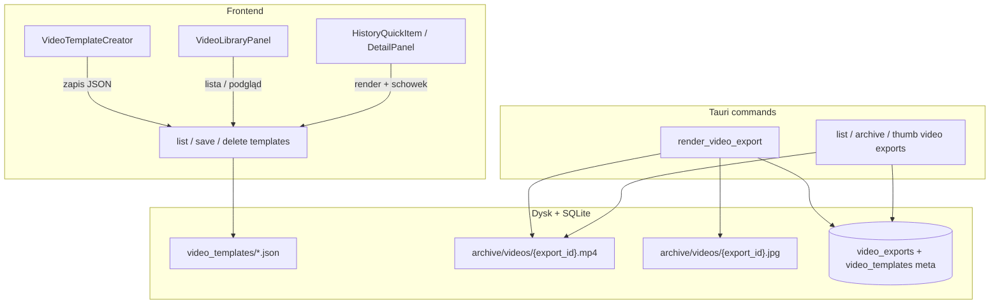
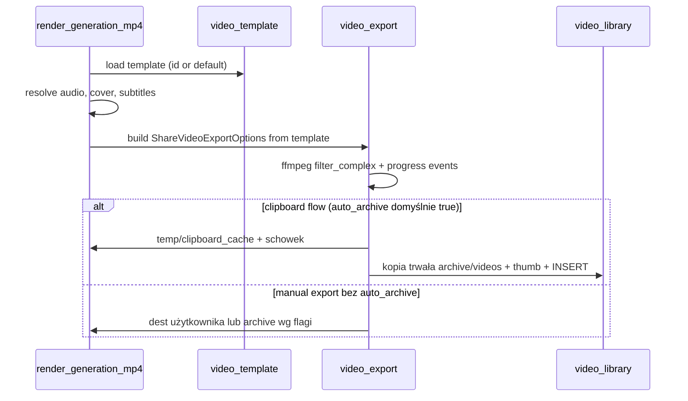

<!-- tts-summary -->
Uaktualniłem plan po Twoich decyzjach. Biblioteka MP4 będzie osobną zakładką Wideo w Historii, auto-zapis po kopiowaniu do schowka domyślnie włączony, a kreator w wersji pierwszej to pełny edytor WYSIWYG z przeciąganiem warstw na canvasie. Szablony nadal zapisujemy jako JSON z pozycjami warstw, a render ffmpeg mapuje te współrzędne jeden do jednego. Szacunek rośnie do około pięciu siedmiu dni przez edytor wizualny i synchronizację podglądu z backendem.
<!-- /tts-summary -->

# Kreator szablonów MP4 + biblioteka wideo

## Cel produktowy

Użytkownik tworzy **własne szablony wideo** (np. WhatsApp 720×720, pion 9:16, poziom 16:9) i **przegląda archiwum gotowych MP4** powiązanych z generacjami TTS — bez grzebania w folderach temp ani polegania wyłącznie na efemerycznym `clipboard_cache`.

| Potrzeba | Rozwiązanie |
|----------|-------------|
| Różne formaty / branding | Kreator szablonów z presetami i własnymi wariantami |
| „Co już wyrenderowałem?” | Biblioteka wideo w Historii z miniaturą i metadanymi |
| Szybki share (WhatsApp) | Zachowany flow: kopiuj MP4 → toast; **auto-zapis do biblioteki domyślnie włączony** |
| Spójność z dziś | Domyślny szablon **WhatsApp Karaoke** = obecny wygląd (cache v4) |

## Stan obecny (punkt wyjścia)

| Warstwa | Pliki / zachowanie |
|---------|-------------------|
| Render | [`src-tauri/src/video_export.rs`](../src-tauri/src/video_export.rs) — stałe `720×720`, ASS karaoke, drawtext stopka/watermark, ffmpeg `filter_complex` |
| Eksport | [`commands.rs`](../src-tauri/src/commands.rs) — `resolve_share_mp4_path`, cache w `temp/clipboard_cache/{id}/`, `VideoCacheMeta` + `KARAOKE_CACHE_VERSION` |
| UI szybkie | [`HistoryQuickItem.tsx`](../src/components/HistoryQuickItem.tsx) — kopiuj MP4; toast po sukcesie |
| UI historia | [`HistoryDetailPanel.tsx`](../src/components/history/HistoryDetailPanel.tsx) — „Zapisz MP4 (WhatsApp)…” |
| Archiwum audio | Zakładka **Archiwum** w [`HistoryBrowseView.tsx`](../src/components/HistoryBrowseView.tsx) — generacje audio, **bez** osobnej warstwy wideo |

**Ograniczenie:** MP4 w `clipboard_cache` to cache pod schowek — może zniknąć przy czyszczeniu temp; brak listy „wszystkich moich wideo”.

---

## Architektura docelowa



---

## 1. Model danych

### 1.1 `VideoTemplate` (JSON + opcjonalnie wiersz w DB)

Lokalizacja plików: `%APPDATA%/TTS_hub/video_templates/{id}.json`  
Rejestr w SQLite: tabela `video_templates` (id, name, updated_at, is_builtin, file_path).

```typescript
// src/types/videoTemplate.ts — kontrakt TS ↔ Rust (v1, warstwy WYSIWYG)

interface VideoRect {
  /** Współrzędne w px względem canvas (źródło prawdy z edytora WYSIWYG) */
  x: number;
  y: number;
  width: number;
  height: number;
}

type VideoLayer =
  | {
      id: string;
      type: "cover";
      visible: boolean;
      rect: VideoRect;
      mode: "profile" | "fixed_image" | "generation_color";
      objectFit: "contain" | "cover";
    }
  | {
      id: string;
      type: "karaoke";
      visible: boolean;
      rect: VideoRect;
      source: "minimax_json" | "estimated_text" | "static_title";
      fontName: string;
      fontSize: number;
      primaryColor: string;
      highlightColor: string;
      outline: number;
      alignment: 2 | 5 | 8; // dół / środek / góra w ramce rect
    }
  | {
      id: string;
      type: "footer";
      visible: boolean;
      rect: VideoRect;
      template: string; // "{{voice}} · {{model}} · {{duration}} · TTS Hub"
      fontSize: number;
      color: string;
      align: "left" | "center" | "right";
    }
  | {
      id: string;
      type: "watermark";
      visible: boolean;
      rect: VideoRect;
      text: string;
      logoPath: string | null;
      opacity: number;
    };

interface VideoTemplate {
  id: string;
  name: string;
  version: 1;
  canvas: { width: number; height: number; background: string };
  layers: VideoLayer[]; // kolejność = z-order (pierwsza = spód)
  output: {
    videoCodec: "libx264";
    audioCodec: "aac";
    audioBitrateK: number;
    tune: "stillimage";
  };
}
```

**Mapowanie WYSIWYG → ffmpeg:** backend liczy `filter_complex` z `rect` każdej warstwy (scale/pad okładki, `ass=` w obszarze karaoke, `drawtext` w rect stopki, overlay watermark). Builtin WhatsApp = jeden JSON z warstwami odwzorowującymi obecny layout.

**Preset wbudowany:** `builtin-whatsapp-karaoke` — wartości z obecnego `video_export.rs` (720×720, cover max 380, alignment 2, margin_v 62, footer drawtext, watermark TTS Hub + logo).

### 1.2 `VideoExport` (rekord biblioteki)

Tabela `video_exports`:

| Kolumna | Opis |
|---------|------|
| id | UUID eksportu |
| generation_id | FK → generations |
| template_id | FK → szablon użyty przy renderze |
| file_path | `archive/videos/{id}.mp4` |
| thumb_path | miniatura JPG (pierwsza klatka lub klatka z okładką) |
| duration_ms | z ffprobe |
| file_size_bytes | |
| render_params_hash | unikalność cache (template + gen mtime + subtitle mtime) |
| created_at | |
| source | `clipboard` \| `manual_export` \| `batch` |
| title | opcjonalny tytuł wyświetlany w bibliotece |

Indeks: `(generation_id, created_at DESC)` — wiele wersji tej samej generacji (różne szablony / re-render).

### 1.3 Migracja / kompatybilność

- Przy starcie: jeśli brak szablonów → wygeneruj `builtin-whatsapp-karaoke.json`.
- `VideoCacheMeta` rozszerzyć o `template_id` + `template_version`; bump `KARAOKE_CACHE_VERSION` → **5**.
- Stary cache bez `template_id` traktować jako invalid (bezpieczny re-render).

---

## 2. Backend (Rust)

### 2.1 Nowe moduły

| Plik | Odpowiedzialność |
|------|------------------|
| `src-tauri/src/video_template.rs` | Deserialize/validate `VideoTemplate`, built-in presets, ścieżki plików |
| `src-tauri/src/video_library.rs` | CRUD `video_exports`, generacja miniatur (`ffmpeg -ss 0 -vframes 1`) |
| Refaktor `video_export.rs` | `build_filter_graph(template, opts) -> filter_complex` zamiast stałych |

### 2.2 Komendy Tauri (propozycja)

| Komenda | Opis |
|---------|------|
| `list_video_templates` | Wszystkie szablony (builtin + user) |
| `get_video_template` / `save_video_template` / `delete_video_template` | CRUD (delete tylko user, nie builtin) |
| `preview_video_template_frame` | Jedna klatka PNG/JPEG do podglądu w kreatorze (sample audio + sample text) |
| `render_generation_mp4` | `{ generation_id, template_id?, dest?, archive?: bool }` — jeden punkt wejścia |
| `list_video_exports` | Filtry: generation_id, template_id, date range, paginacja |
| `get_video_export_thumb` / `video_export_stream_path` | Podgląd w UI |
| `delete_video_export` | Plik + rekord DB |
| `copy_video_export_to_clipboard` | Istniejąca logika schowka, ale ze ścieżki z biblioteki |

Istniejące `copy_generation_mp4_to_clipboard` i `export_generation_mp4_to_path` delegują do `render_generation_mp4` z domyślnym szablonem z ustawień.

### 2.3 Render pipeline (refaktor)



**Walidacja szablonu:** rozmiar canvas 480–1920, dozwolone fonty (lista system + fallback Arial), logo tylko z whitelist katalogów app data.

---

## 3. Kreator szablonów WYSIWYG (UI) — **wymagany w v1**

### 3.1 Wejście w aplikacji

**Ustalone:** podsekcja **Ustawienia → Wideo / MP4** (pełnoekranowy edytor w ramach ustawień lub osobny widok `VideoStudioView` otwierany z tej zakładki).

### 3.2 Układ ekranu kreatora

```
┌──────────────────────────────────────────────────────────────────┐
│ Szablony          │  Canvas WYSIWYG (skala dopasowana)  │ Warstwy │
│ • WhatsApp        │  ┌─ ─ ─ ─ ─ ─ ─ ─ ─ ─ ─ ─ ┐         │ ☑ Okładka│
│ • Pion 9:16       │  │ [okładka — drag/resize] │         │ ☑ Karaoke│
│ [+ Preset]        │  │                         │         │ ☑ Stopka │
│                   │  │ [karaoke — drag/resize] │         │ ☑ WM     │
│                   │  │ [stopka]    [watermark]│         │         │
│                   │  └─ ─ ─ ─ ─ ─ ─ ─ ─ ─ ─ ─ ┘         │ Panel   │
│                   │  snap · siatka · % zoom · 720×720    │ właściw.│
│                   │  [Podgląd ffmpeg] [Zapisz] [Duplikuj]│ wybranej│
└──────────────────────────────────────────────────────────────────┘
```

### 3.3 Edytor WYSIWYG — zachowanie

| Funkcja | Opis |
|---------|------|
| **Warstwy** | Okładka, karaoke, stopka, watermark — każda jako box z `rect` (x, y, w, h) |
| **Drag & drop** | Przesuwanie warstwy myszą / touch; shift = oś blokowana |
| **Resize** | 8 uchwytów (narożniki + krawędzie); min. rozmiary per typ warstwy |
| **Z-order** | Panel warstw: ukryj/pokaż, przesuń w górę/dół |
| **Snap** | Do krawędzi canvas, centrum, innych warstw (progi 8 px) |
| **Siatka** | Opcjonalna siatka 8 px + linie pomocnicze środka |
| **Zoom** | 25–200 % podglądu; canvas logiczny zawsze w px szablonu |
| **Selekcja** | Klik = warstwa aktywna; panel właściwości po prawej (font, kolory, template stopki) |
| **Presety** | WhatsApp 720×720, 9:16, 16:9 — wstawiają zestaw warstw z sensownymi rect |
| **Podgląd natychmiastowy** | HTML/CSS na canvasie (mock okładka, przykładowy tekst karaoke) |
| **Weryfikacja ffmpeg** | Przycisk „Podgląd renderu” lub debounce 800 ms → `preview_video_template_frame` — porównanie z WYSIWYG |
| **Zmienne stopki** | Picker `{{voice}}`, `{{model}}`, `{{duration}}`, `{{title}}`, `{{date}}` |

**Implementacja techniczna (propozycja):**

- Canvas: `div` ze `position: relative`, warstwy jako absolutnie pozycjonowane elementy w skali `scale = viewport / canvas.width`.
- Interakcja: lekki hook `useLayerDragResize` (pointer events, bez ciężkiej biblioteki) **lub** `@dnd-kit/core` tylko do reorder warstw + własny resize.
- Stan: `VideoTemplate.layers` — jeden obiekt stanu; undo/redo (v1.1 opcjonalnie, v1 minimum: confirm przy wyjściu bez zapisu).
- Sync z backendem: zapis JSON = dokładnie to, co w edytorze; renderer nie „domyśla” pozycji poza rect.

### 3.4 Pliki frontend (nowe)

| Plik | Rola |
|------|------|
| `src/components/video/VideoTemplateCreator.tsx` | Layout: lista szablonów + canvas + panel |
| `src/components/video/VideoTemplateCanvas.tsx` | WYSIWYG canvas, snap, zoom |
| `src/components/video/VideoLayerBox.tsx` | Pojedyncza warstwa (drag/resize handles) |
| `src/components/video/VideoLayerList.tsx` | Panel warstw (visibility, z-order) |
| `src/components/video/VideoLayerInspector.tsx` | Właściwości zaznaczonej warstwy |
| `src/hooks/useLayerDragResize.ts` | Logika pointer + snap |
| `src/lib/videoTemplatePresets.ts` | Presety canvas + domyślne rect warstw |
| `src/lib/videoTemplates.ts` | API invoke, serializacja |
| `src/types/videoTemplate.ts` | Typy warstw i szablonu |

Integracja ustawień: [`Settings.tsx`](../src/components/Settings.tsx) — nowa zakładka + `default_video_template_id` w `AppSettings`.

---

## 4. Biblioteka wideo / archiwum MP4 (UI)

### 4.1 Miejsce w nawigacji — **ustalone: osobna zakładka**

Nowa zakładka scope w Historii: **`video`** (ikona dedykowana `video` lub `clip-external`), **nie** filtr w Archiwum audio.

```typescript
// historyToolbar.ts — rozszerzenie
export type HistoryScopeTab =
  | "session" | "archive" | "cursor" | "bots" | "soundboard" | "video";
```

[`HistoryScopeRail.tsx`](../src/components/history/HistoryScopeRail.tsx) + [`HistoryBrowseView.tsx`](../src/components/HistoryBrowseView.tsx): trzeci panel jak przy archiwum — lista + szczegóły.

### 4.2 Widok listy

- **Siatka kart** (domyślnie) / opcjonalnie lista kompaktowa.
- Karta: miniatura, tytuł generacji, szablon, czas trwania, data, rozmiar pliku.
- Filtry: szablon, profil głosu, zakres dat, wyszukiwanie po tytule.
- Sortowanie: najnowsze first.

### 4.3 Panel szczegółów / podgląd

- `<video controls>` z `convertFileSrc` (Tauri asset protocol).
- Metadane: powiązana generacja (link → załaduj w TTS), użyty szablon, ścieżka pliku.
- Akcje:
  - Odtwórz / Pauza
  - **Kopiuj do schowka** (WhatsApp)
  - **Zapisz jako…** (dialog save)
  - **Pokaż w eksploratorze**
  - **Renderuj ponownie** (wybór innego szablonu → nowy wpis w bibliotece)
  - **Usuń** (confirm)
  - **Otwórz generację źródłową**

### 4.4 Pliki frontend (nowe)

| Plik | Rola |
|------|------|
| `src/components/video/VideoLibraryPanel.tsx` | Layout zakładki Wideo |
| `src/components/video/VideoExportCard.tsx` | Kafel siatki |
| `src/components/video/VideoExportDetail.tsx` | Podgląd + akcje |
| `src/hooks/useVideoExports.ts` | Pobieranie listy, paginacja |

### 4.5 Auto-archiwizacja — **ustalone: domyślnie włączona**

W **Ustawienia → Wideo:**

- `auto_archive_mp4_on_clipboard`: **`true` domyślnie** — po każdym udanym `copy_generation_mp4_to_clipboard` trwała kopia w `video_exports` + miniatura. Użytkownik może wyłączyć w ustawieniach.
- `default_video_template_id` — szablon dla szybkiego kopiowania.

Toast po schowku: **„MP4 w schowku · zapisano w bibliotece Wideo”** (gdy auto-archiwizacja aktywna).

---

## 5. Integracja z istniejącymi flow

| Miejsce | Zmiana |
|---------|--------|
| `HistoryQuickItem` | Opcjonalnie long-press / submenu: „Kopiuj MP4 (szablon…)” |
| `HistoryDetailPanel` | Dropdown szablonu przy „Zapisz MP4” |
| `TimelinePanelMenu` | To samo przy kopiuj/zapisz MP4 |
| `AppSettings` | `default_video_template_id`, `auto_archive_mp4_on_clipboard` |
| Postęp renderu | Bez zmian — event `mp4-export-progress` |
| Czyszczenie temp | `clipboard_cache` nadal efemeryczny; biblioteka niezależna |

**Nie psuć:** obecny domyślny wygląd WhatsApp = builtin template; użytkownik bez konfiguracji nie widzi regresji.

---

## 6. Fazy implementacji

### Faza 1 — Fundament (≈1 dzień)

- [ ] Typ `VideoTemplate` + walidacja Rust
- [ ] Plik builtin + migracja DB `video_exports`, `video_templates`
- [ ] Katalogi `video_templates/`, `archive/videos/`
- [ ] Komendy list/get/save template (bez UI)

### Faza 2 — Renderer (≈1–1,5 dnia)

- [ ] Refaktor `video_export.rs` na template-driven filter graph
- [ ] `render_generation_mp4` z `template_id`
- [ ] Rozszerzenie cache meta; test regresji obecnego MP4 (pixel-diff lub manual QA checklist)
- [ ] Generacja miniatur po renderze

### Faza 3 — Kreator WYSIWYG (≈2–3 dni)

- [ ] Zakładka Ustawienia → Wideo
- [ ] Canvas z warstwami: drag, resize, snap, z-order, zoom
- [ ] Panel warstw + inspector właściwości
- [ ] Podgląd HTML natychmiastowy + weryfikacja klatki ffmpeg
- [ ] Presety 9:16 / 16:9 / WhatsApp
- [ ] Zapis / duplikacja / usuwanie (user templates)

### Faza 4 — Biblioteka wideo (≈1 dzień)

- [ ] Scope `video` w Historii
- [ ] Siatka + detail + odtwarzacz
- [ ] Akcje schowek / eksport / usuń / re-render
- [ ] Auto-archiwizacja po schowku (domyślnie on; toggle w ustawieniach)

### Faza 5 — Dopracowanie (≈0,5–1 dnia)

- [ ] Wybór szablonu w quick actions (opcjonalnie v1.1)
- [ ] Dokumentacja `docs/VIDEO_TEMPLATES.md`
- [ ] Testy: brak napisów MiniMax, Voicebox bez JSON, duży tekst, cache hit/miss
- [ ] Limity dysku: info w ustawieniach storage (reuse `local_storage.rs`)

**Szacunek łącznie:** **5–7 dni roboczych** (WYSIWYG + synchronizacja z ffmpeg).

---

## 7. Potwierdzone decyzje produktowe

| # | Pytanie | Decyzja |
|---|---------|---------|
| 1 | Biblioteka w Historii | **Osobna zakładka „Wideo”** |
| 2 | Auto-zapis po schowku | **Tak, domyślnie włączony** (możliwość wyłączenia w ustawieniach) |
| 3 | Kreator v1 | **WYSIWYG z drag-and-drop warstw** (nie sam formularz) |

### Pozostałe ustalenia techniczne

| Temat | Decyzja |
|-------|---------|
| Gdzie trzymać szablony | JSON w app data + meta DB |
| Podgląd w kreatorze | WYSIWYG HTML natychmiast + opcjonalna klatka ffmpeg do weryfikacji |
| Wiele MP4 na generację | Tak (historia renderów) |
| Fonty custom | v2 — upload do `fonts/`; v1 systemowe |

---

## 8. Kryteria akceptacji

- [ ] Builtin szablon WhatsApp daje wizualnie ten sam MP4 co przed refaktorem (karaoke w linii u dołu, okładka u góry).
- [ ] Użytkownik tworzy nowy szablon 9:16, zapisuje, renderuje generację — MP4 ma poprawne proporcje.
- [ ] Zakładka Wideo pokazuje wszystkie zarchiwizowane eksporty z miniaturą i odtwarzaczem.
- [ ] Kopiuj do schowka działa z toastem; wpis **automatycznie** pojawia się w zakładce Wideo (domyślnie).
- [ ] Kreator WYSIWYG: przesunięcie warstwy na canvasie zmienia pozycję w wyrenderowanym MP4 (zgodność rect ↔ ffmpeg).
- [ ] Usunięcie wpisu biblioteki nie usuwa generacji audio ani szablonu.
- [ ] Re-render z innym szablonem tworzy nowy rekord bez nadpisywania starego pliku.

---

## 9. Dokumentacja (przy implementacji)

- `docs/VIDEO_TEMPLATES.md` — opis pól szablonu, presety, zmienne stopki, limity ffmpeg.
- Krótki akapit w README / onboarding: „Wideo → szablony → biblioteka”.

---

## 10. Poza zakresem v1 (backlog)

- Undo/redo w edytorze WYSIWYG (v1.1)
- Animowane tła / wiele slajdów okładki
- Import szablonu z pliku (share JSON między instalacjami)
- Batch export wielu generacji do MP4
- Eksport bez watermarku (plan Pro / toggle)
- Integracja z Roleplay Studio (wspólny silnik wideo)
