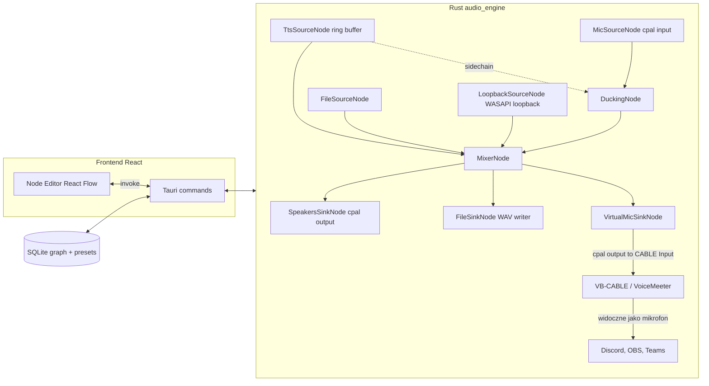

## Wstęp (PL)

Zmieniamy TTS Hub z aplikacji "wygeneruj plik i odtwórz" w realtime'owy router audio. Dodajemy nowy moduł silnika audio w Rust (`src-tauri/src/audio_engine/`) oparty na `cpal`, który trzyma graf węzłów w pamięci i w pętli ~10 ms miksuje próbki PCM. Istniejący kod TTS (`src-tauri/src/audio.rs`, `google.rs`, `minimax.rs`, `voicebox.rs`) zostaje rozszerzony tak, że oprócz zapisu do pliku potrafi też wpychać PCM do ring-buffera "TTS source" w grafie. Na froncie pojawia się nowy widok `Routing` z edytorem opartym o React Flow — użytkownik łączy źródła (TTS, mikrofon, plik, loopback) z procesorami (gain, mixer, ducking, EQ/kompresor/gate) i wyjściami (głośniki, plik, wirtualny mikrofon). Wirtualny mikrofon realizujemy strategią auto-detect: skanujemy urządzenia wyjściowe Windows szukając VB-CABLE / VoiceMeeter Input; jeśli nic nie znajdziemy, pokazujemy onboardingowy ekran z linkiem do VB-CABLE. Ulepszenia: realtime mix TTS z mikrofonem, ducking (TTS przycisza Twój głos), persystencja grafu w SQLite, wielokrotne presety routingu, niezależność od ffmpeg dla live'owego flow. Skala: ~2–3 tygodnie pracy dewelopera (silnik DSP + node editor + integracja).

---

## Architektura



## Stack

- **Rust silnik**: `cpal` (I/O), `ringbuf` (lock-free SPSC bufory między wątkami), `rubato` (resampling SR), `biquad` (filtry EQ/HPF/LPF), własny prosty kompresor/gate/ducker. Format wewnętrzny: `f32` mono lub stereo, 48 kHz.
- **Frontend**: `reactflow` (`npm i reactflow`), istniejący Vite/React.
- **Persystencja**: rozszerzenie [src-tauri/src/db.rs](src-tauri/src/db.rs) o tabelę `routing_graphs(id, name, json, is_active, updated_at)`.

## Wirtualny mikrofon — strategia auto-detect

1. Przy starcie aplikacji w nowej funkcji `audio_engine::virtual_mic::detect()` skanujemy `cpal::default_host().output_devices()` szukając nazw:
   - `CABLE Input (VB-Audio Virtual Cable)` → wybór preferowany (lekki, darmowy)
   - `VoiceMeeter Input`, `VoiceMeeter VAIO3 Input` → fallback
2. Wynik (`enum VirtualMicBackend { VbCable, Voicemeeter, None }`) trzymany w `AppState`.
3. Jeśli `None` — node `VirtualMicSinkNode` w UI pokazuje się jako "Niedostępny" z przyciskiem "Zainstaluj VB-CABLE" otwierającym `https://vb-audio.com/Cable/`. Po instalacji ponowne skanowanie via Tauri command `rescan_virtual_mic`.
4. Sink po prostu otwiera `cpal::build_output_stream` na wybranym device i pisze tam zmiksowaną sumę.

## Pliki — nowe

- [src-tauri/src/audio_engine/mod.rs](src-tauri/src/audio_engine/mod.rs) — `Engine`, start/stop, główna pętla na osobnym wątku.
- [src-tauri/src/audio_engine/graph.rs](src-tauri/src/audio_engine/graph.rs) — `Graph { nodes, edges }`, topologiczne sortowanie, walidacja (brak cykli, dopasowanie kanałów).
- [src-tauri/src/audio_engine/nodes/](src-tauri/src/audio_engine/nodes/) — po pliku na typ węzła: `tts_source.rs`, `mic_source.rs`, `file_source.rs`, `loopback_source.rs`, `gain.rs`, `mixer.rs`, `ducking.rs`, `dsp.rs` (eq/comp/gate), `speakers_sink.rs`, `file_sink.rs`, `virtual_mic_sink.rs`.
- [src-tauri/src/audio_engine/virtual_mic.rs](src-tauri/src/audio_engine/virtual_mic.rs) — detekcja + install prompt.
- [src-tauri/src/audio_engine/devices.rs](src-tauri/src/audio_engine/devices.rs) — `list_input_devices()`, `list_output_devices()`.
- [src/routing/RoutingView.tsx](src/routing/RoutingView.tsx) — widok z React Flow.
- [src/routing/nodes/](src/routing/nodes/) — komponenty React per typ node'a.
- [src/routing/api.ts](src/routing/api.ts) — wrappery `invoke(...)`.

## Pliki — modyfikowane

- [src-tauri/Cargo.toml](src-tauri/Cargo.toml) — dodać `cpal = "0.15"`, `ringbuf = "0.4"`, `rubato = "0.15"`, `biquad = "0.5"`.
- [src-tauri/src/lib.rs](src-tauri/src/lib.rs) — `mod audio_engine;`, inicjalizacja `Engine` w `setup`, rejestracja nowych komend.
- [src-tauri/src/commands.rs](src-tauri/src/commands.rs) — nowe komendy: `list_audio_devices`, `get_routing_graph`, `save_routing_graph`, `set_active_graph`, `engine_start`, `engine_stop`, `engine_status`, `rescan_virtual_mic`, `set_node_param` (live updates bez restartu silnika).
- [src-tauri/src/state.rs](src-tauri/src/state.rs) — `pub engine: Arc<Mutex<audio_engine::Engine>>`.
- [src-tauri/src/db.rs](src-tauri/src/db.rs) — migracja tabeli `routing_graphs`.
- [src-tauri/src/google.rs](src-tauri/src/google.rs), [minimax.rs](src-tauri/src/minimax.rs), [voicebox.rs](src-tauri/src/voicebox.rs) — po wygenerowaniu PCM, jeśli `engine.has_tts_subscribers()`, wpychamy próbki do ringbuf TTS source (równolegle do dotychczasowego zapisu pliku).
- [src/main.tsx](src/main.tsx) i layout — dodać route `/routing`, link w menu.

## Model danych grafu (JSON)

```json
{
  "version": 1,
  "nodes": [
    { "id": "tts1", "type": "tts_source", "params": {} },
    { "id": "mic1", "type": "mic_source", "params": { "device": "Microphone (Realtek)" } },
    { "id": "duck1", "type": "ducking", "params": { "threshold_db": -30, "ratio": 8, "attack_ms": 5, "release_ms": 200 } },
    { "id": "mix1", "type": "mixer", "params": { "channels": [{"gain_db": 0}, {"gain_db": -3}] } },
    { "id": "vmic", "type": "virtual_mic_sink", "params": {} }
  ],
  "edges": [
    { "from": "mic1", "to": "duck1", "in_port": "audio" },
    { "from": "tts1", "to": "duck1", "in_port": "sidechain" },
    { "from": "duck1", "to": "mix1", "in_port": 0 },
    { "from": "tts1", "to": "mix1", "in_port": 1 },
    { "from": "mix1", "to": "vmic", "in_port": "audio" }
  ]
}
```

## Realtime engine — kluczowy fragment

Główna pętla na dedykowanym wątku, sterowana callbackiem `cpal` outputu wirtualnego mikrofonu (driver-clock):

```rust
fn run_block(graph: &CompiledGraph, frames: usize, out: &mut [f32]) {
    for node_id in &graph.topo_order {
        let node = &mut graph.nodes[*node_id];
        node.process(frames, &graph.buffers);
    }
    graph.buffers.copy_sink_to(out);
}
```

`CompiledGraph` to spłaszczona, posortowana topologicznie wersja JSON-a — kompilowana raz przy `engine_start` lub zmianie grafu. Zmiany parametrów (gain, próg duckera) idą przez SPSC `ringbuf<ParamUpdate>` żeby nie blokować audio-threada.

## UX node-editora

- Lewy sidebar: paleta typów node'ów (drag-and-drop na płótno).
- Każdy node ma porty wejść/wyjść kolorowane wg typu (audio = niebieski, sidechain = pomarańczowy).
- Klik w node → prawy panel z parametrami (slidery gain w dB, threshold, attack/release).
- Górny pasek: dropdown "Aktywny preset" + przycisk "Engine: ON/OFF" z lampką stanu, wskaźnik VU dla każdego node'a (poll co 50 ms via `engine_status`).
- Walidacja po stronie Rust (brak cykli, kompatybilność portów) — błąd wracający do UI jako toast.

## Plan etapowy

1. Bootstrap silnika: `cpal` list devices + minimalny graf `mic_source → speakers_sink` (passthrough mic do głośników). Komendy `list_audio_devices`, `engine_start/stop`.
2. Persystencja grafu (SQLite + komendy save/load), kompilacja JSON → `CompiledGraph`, sortowanie topologiczne.
3. Frontend: instalacja React Flow, podstawowy edytor z 3 typami node'ów (source/passthrough/sink), zapis do backendu.
4. TTS source: podpięcie istniejących generatorów ([google.rs](src-tauri/src/google.rs) itd.) do ring-buffera. Resampling do 48 kHz przez `rubato`.
5. Mixer + Gain — najprostsze DSP, weryfikacja sum próbek f32 z clippingiem.
6. Wirtualny mikrofon: detekcja VB-CABLE/VoiceMeeter, sink, onboarding install (nowe okno albo modal w `RoutingView`).
7. Ducking (sidechain z TTS jako kluczem, kompresor over mic).
8. Pozostałe DSP: noise gate, EQ (3-band biquad), kompresor. Loopback source (Windows WASAPI loopback).
9. File source (odtwarzanie + soundboard) i File sink (nagrywanie sesji).
10. Polish: VU metery, presety, walidacja, dokumentacja w `docs/ROUTING.md`.

## Ryzyka i otwarte kwestie

- **Latencja**: cpal na WASAPI shared mode ≈ 20–40 ms; dla shared-target (Discord) wystarczy. Exclusive mode niepotrzebny.
- **VB-CABLE jako dependency**: użytkownik musi raz zainstalować (UAC). Onboarding musi to wyraźnie tłumaczyć.
- **Loopback na Windows**: cpal wspiera WASAPI loopback od wersji 0.15+ — zweryfikować przy implementacji.
- **Synchronizacja zegarów**: różne devices mają lekko różne SR — `rubato` w trybie asynchronicznym rozwiązuje, ale zjada CPU; warto cache'ować resamplery.
- **Reset grafu w locie**: zmiana topologii wymaga przebudowy `CompiledGraph` — robimy double-buffer (stary graf gra do końca bloku, potem swap).