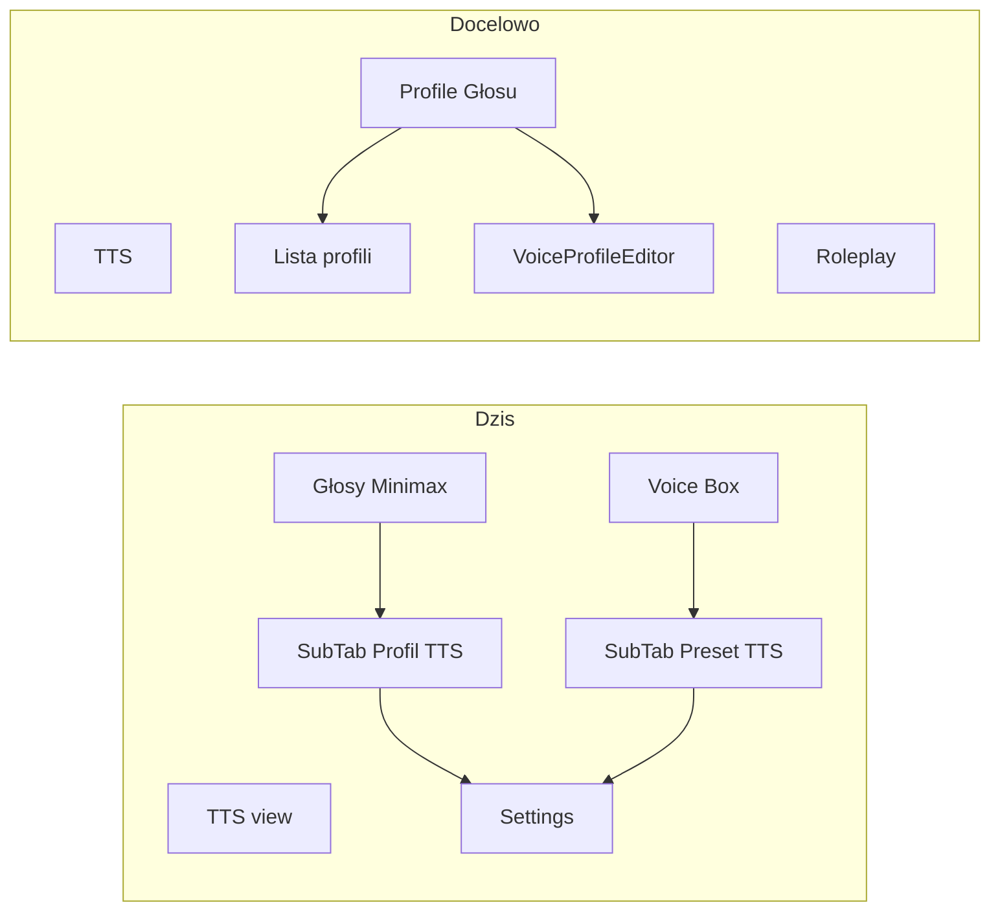
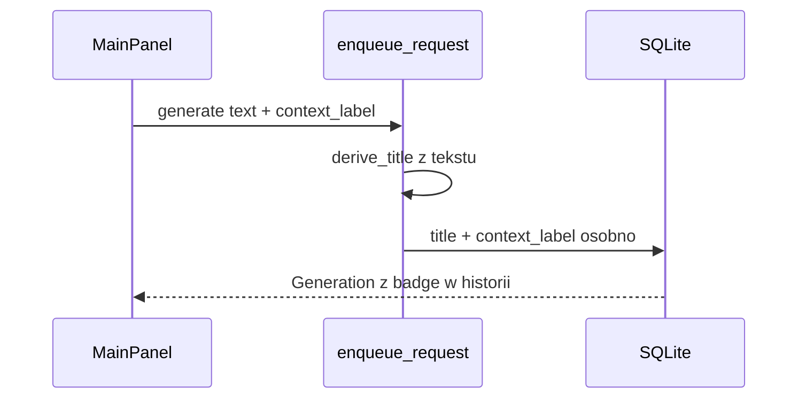

# Plan: Profile Głosu — nowy panel i pełny edytor

<!-- tts-summary -->
Przeniosę konfigurację profili z podzakładki „Profil TTS” w Minimax do nowej głównej zakładki „Profile Głosu” między TTS a Roleplay. Powstanie widok dwukolumnowy z listą profili i nowym edytorem opartym o schemat pól per provider, z trybem podstawowym i zaawansowanym. Ujednolicę kontrolki: tooltipy z domyślnymi wartościami, reset prawym przyciskiem i przeciąganie liczb. Do API generacji dodam osobne pole context_label widoczne jako badge w historii, bez zmiany tytułu z tekstu. Nieużywane jeszcze opcje providerów pokażę wyszarzone, a 2D placement i rozszerzone efekty dźwiękowe wpiszę do roadmapy. Prace idą w jednym przebiegu: nawigacja, UI, backend i dokumentacja.
<!-- /tts-summary -->

## Stan obecny

Konfiguracja profilu jest rozproszona:

- [`MinimaxVoicesView.tsx`](../src/components/MinimaxVoicesView.tsx) — sub-tab **Profil TTS** renderuje [`Settings`](../src/components/Settings.tsx) + [`SaveVoiceProfileFooter`](../src/components/SaveVoiceProfileFooter.tsx)
- [`VoiceboxView.tsx`](../src/components/VoiceboxView.tsx) — sub-tab **Preset TTS** (to samo, provider wymuszony)
- Wejścia: [`SettingsSidebar`](../src/components/SettingsSidebar.tsx), [`VoiceProfilesPage`](../src/components/settings/pages/VoiceProfilesPage.tsx) → `openMinimaxVoices("profile")` / `openVoiceboxView("tts_preset")`
- Zapis **zawsze tworzy nowy profil** — `settingsStateToVoiceProfile` w [`voiceProfiles.ts`](../src/lib/voiceProfiles.ts) już obsługuje `existingId`, ale footer go nie przekazuje
- Brak `context_label` w [`commands.rs`](../src-tauri/src/commands.rs) / [`types.ts`](../src/types.ts)

## 1. Nawigacja — nowa zakładka główna

**Pliki:** [`AppViewTabs.tsx`](../src/components/AppViewTabs.tsx), [`App.tsx`](../src/App.tsx), [`AppViewContext.ts`](../src/context/AppViewContext.ts), [`icons.ts`](../src/lib/icons.ts)

- Rozszerzyć `AppView` o `"voice_profiles"` (id wewnętrzne; etykieta UI: **Profile Głosu**)
- Wstawić w tablicy `tabs` **zaraz po TTS, przed Roleplay** — zawsze widoczna (nie jak Minimax/Voicebox)
- Dodać ikonę `tab-voice-profiles` (nowy SVG lub adaptacja istniejącej)
- W `App.tsx` → `AppInner`: nowa gałąź renderująca `VoiceProfilesView` z tym samym `ttsSettings` co TTS/Minimax (współdzielony stan edytora)
- W `AppViewContext`: `openVoiceProfiles(profileId?: string)` — ustawia widok + opcjonalnie ładuje profil do edycji

## 2. Nowy widok `VoiceProfilesView`

**Nowy plik:** `src/components/voiceProfiles/VoiceProfilesView.tsx`

Layout dwukolumnowy (jak TTS sidebar + panel):

| Lewa kolumna (~1fr) | Prawa kolumna (~2fr) |
|---------------------|----------------------|
| `VoiceProfilesListPanel` (reuse) | `VoiceProfileEditor` |
| Przycisk „Nowy profil” | `SaveVoiceProfileFooter` (ulepszony) |

Zachowanie:

- Klik profilu → `voiceProfileToSettingsState` + ustawienie `editingProfileId`
- „Nowy profil” → reset do domyślnego `SettingsState` + `editingProfileId = null`
- Edycja istniejącego → przycisk **Zapisz zmiany** (update) zamiast duplikatu
- Nagłówek z krótkim opisem workflow (wybierz profil → skonfiguruj → wróć do TTS)

## 3. Edytor `VoiceProfileEditor` — schemat pól per provider

**Nowe pliki:**

- `src/components/voiceProfiles/VoiceProfileEditor.tsx` — główny formularz
- `src/lib/voiceProfileFields.ts` — deklaratywny schemat pól (`FieldDef[]`)
- `src/lib/voiceProfileProviderCapabilities.ts` — mapowanie: `implemented` | `disabled` | `roadmap`

**Kolejność UI (zawsze):**

1. **Provider** — karty/przyciski z ikonami (`PROVIDER_TABS` z [`providerSwitch.ts`](../src/lib/providerSwitch.ts)); tylko włączone providery
2. **Tryb** — przełącznik Podstawowy / Zaawansowany (stan lokalny, zapamiętany w `localStorage`)
3. **Sekcje pól** wg providera (grid responsywny)

### Pola — podstawowy tryb

| Provider | Pola |
|----------|------|
| **Google** | model, głos (`VoiceSamples`), styl, multi-speaker (toggle + 2 mówcy) |
| **Minimax** | model, głos (presety + klony), język, speed/vol/pitch (suwaki) |
| **Voice Box** | model, profil VB, język, personality (checkbox), status serwera |

### Pola — zaawansowany tryb

- **Google:** bez dodatkowych (API Hub = pełne)
- **Minimax:** przenieść/refaktor [`MinimaxAdvancedOptions.tsx`](../src/components/MinimaxAdvancedOptions.tsx) do sekcji schematu (emotion, audio, voice_modify suwaki, pronunciation_dict, timbre_weights, transport, subtitles…)
- **Voice Box:** pola z [`GenerationRequest`](../voicebox-backend/backend/models.py) **niewspierane przez klienta Rust** — pokazać wyszarzone z tooltipem „Niedostępne w TTS Hub”:
  - `seed`, `model_size`, `max_chunk_chars`, `crossfade_ms`, `normalize`, `effects_chain`

### Pola roadmap (wyszarzone, badge „Roadmapa”)

- **2D placement** — pitch/intensity/timbre na płaszczyźnie XY (zamiast trzech suwaków voice_modify)
- **Efekty dźwiękowe** — rozszerzony kreator łańcucha efektów (poza obecnym selectem MiniMax `sound_effects` w voice_modify)

Logika disabled: rozszerzyć [`minimaxCapabilities.ts`](../src/lib/minimaxCapabilities.ts) o uniwersalny `getFieldAvailability(provider, fieldKey, ctx)`.

**Refaktor istniejącego kodu:**

- [`Settings.tsx`](../src/components/Settings.tsx) — zostawić jako cienki wrapper lub deprecated; logika providerów przeniesiona do `VoiceProfileEditor` (współdzielenie z [`TtsPresetFields.tsx`](../src/components/TtsPresetFields.tsx) przez wspólne hooki: `useProviderCatalog`, `useMinimaxCatalog`)
- Quick Hotkeys nadal używają `TtsPresetFields` — bez regresji

## 4. Wspólne kontrolki pól

**Nowe pliki:** `src/components/voiceProfiles/fields/`

| Komponent | Odpowiedzialność |
|-----------|------------------|
| `ProfileFieldShell` | label + tooltip (domyślna wartość z `FieldDef.defaultHint`) + badge statusu |
| `ScrubNumberInput` | `<input type="number">` + drag góra/dół (pointer capture, step z `FieldDef`) — wzorzec jak w DAW |
| `ProfileSlider` | range + opcjonalny scrub na labelu liczby |
| `ProfileSelect` / `ProfileToggle` / `ProfileTextarea` | owinięte w shell |
| `useFieldReset` | PPM → `onContextMenu` → przywróć wartość domyślną z profilu providera |

Każde pole w schemacie definiuje: `key`, `label`, `tooltip`, `defaultValue`, `mode: basic|advanced`, `control: slider|select|toggle|scrub|textarea|custom`, `availability`.

## 5. Zapis i edycja profilu

**Plik:** [`SaveVoiceProfileFooter.tsx`](../src/components/SaveVoiceProfileFooter.tsx)

- Nowe propsy: `editingProfileId?: string | null`, `onSaved?: (profile: TtsVoiceProfile) => void`
- Gdy `editingProfileId` ustawione:
  - nazwa wstępnie wypełniona z profilu
  - przycisk **Zapisz zmiany** → `settingsStateToVoiceProfile(..., existingId)` + replace w tablicy zamiast append
- Zachować avatar (`VoiceAvatarControl`), skrót, konflikt hotkeyów

## 6. API `context_label` (osobne pole — decyzja użytkownika)

**Backend (Rust):**

- [`commands.rs`](../src-tauri/src/commands.rs) — `GenerateReq.context_label: Option<String>`
- [`db.rs`](../src-tauri/src/db.rs) — migracja `ALTER TABLE generations ADD COLUMN context_label TEXT`; rozszerzyć `Generation` struct + `GEN_SELECT`
- `enqueue_request` — zapis snapshotu; **nie** modyfikować `derive_title`
- [`http_api.rs`](../src-tauri/src/http_api.rs) — przekazać pole w POST `/generate`

**Frontend:**

- [`types.ts`](../src/types.ts) — `context_label?: string | null` na `GenerateRequest` i `Generation`
- [`MainPanel.tsx`](../src/components/MainPanel.tsx) — opcjonalne pole „Kontekst / projekt / sesja” nad przyciskiem generacji; wartość zapamiętana w `localStorage` (`tts_context_label`)
- [`HistoryItem.tsx`](../src/components/HistoryItem.tsx), [`HistoryDetailPanel.tsx`](../src/components/history/HistoryDetailPanel.tsx) — badge/tag obok tytułu gdy `context_label` ustawione
- [`docs/API.md`](../docs/API.md) — dokumentacja pola

## 7. Migracja wejść nawigacyjnych

Zaktualizować wszystkie odwołania `openMinimaxVoices("profile")` / `openVoiceboxView("tts_preset")` → `openVoiceProfiles()`:

- [`SettingsSidebar.tsx`](../src/components/SettingsSidebar.tsx)
- [`VoiceProfilesPage.tsx`](../src/components/settings/pages/VoiceProfilesPage.tsx)
- [`App.tsx`](../src/App.tsx) (`onEditProfile` flow)
- Ewentualnie tutorial [`ttsTourSteps.ts`](../src/components/tutorial/ttsTourSteps.ts)

**Usunąć / wyczyścić:**

- Sub-tab **Profil TTS** z [`MinimaxVoicesView.tsx`](../src/components/MinimaxVoicesView.tsx) (zostają: Klonowanie, Voice Design, Presety, Języki)
- Sub-tab **Preset TTS** z [`VoiceboxView.tsx`](../src/components/VoiceboxView.tsx); typ `VoiceboxSection` bez `tts_preset`
- [`minimaxVoicesSections.ts`](../src/components/minimaxVoicesSections.ts) — usunąć `"profile"` z union (lub zostawić jako alias redirect dla kompatybilności deep-linków → `openVoiceProfiles`)

## 8. Roadmapa w dokumentacji

Dopisać do [`README.md`](../README.md) (sekcja Planowane) i [`docs/SPECIFICATION.md`](../docs/SPECIFICATION.md) §10:

- 2D placement parametrów głosu (voice_modify XY pad)
- Rozszerzony edytor efektów dźwiękowych (Voice Box `effects_chain` + MiniMax sound effects)
- Voice Box: seed, chunking, normalize w profilu (po rozszerzeniu klienta Rust)

## 9. Mock UI i testy ręczne

- [`fixtures.ts`](../src/lib/mockUi/fixtures.ts) — upewnić się, że nowy widok działa w mock mode
- Checklist weryfikacji:
  - Nowa zakładka między TTS a Roleplay
  - Tworzenie / edycja / duplikat profilu (edycja nie tworzy kopii)
  - Wszystkie 3 providery w podstawowym i zaawansowanym trybie
  - Wyszarzone pola VB + roadmap badges
  - Tooltip + PPM reset + scrub liczby
  - `context_label` w UI, HTTP API i badge historii
  - Minimax Voices / Voice Box bez sub-tabów profilu

## Ryzyka i ograniczenia

- Duży diff — refaktor `Settings` bez psucia Quick Hotkeys (`TtsPresetFields` zostaje)
- `context_label` wymaga migracji DB (additive, bezpieczna)
- Pełna implementacja Voice Box advanced wymaga rozszerzenia [`voicebox.rs`](../src-tauri/src/voicebox.rs) — w tym planie pola są **widoczne wyszarzone**, nie podłączone do API
