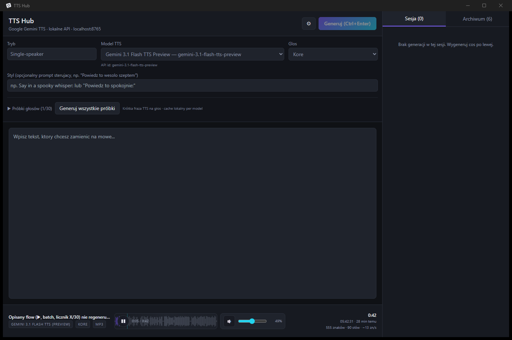

<div align="center">

# TTS Hub

**Desktopowa aplikacja do syntezy mowy (Google Gemini TTS) z lokalnym API HTTP**

[](https://tauri.app/)
[](https://react.dev/)
[](https://www.rust-lang.org/)
[](https://www.typescriptlang.org/)
[](docs/PUBLICATION_READINESS.md)

[Instalacja](#-szybki-start) · [Funkcje](#-funkcje) · [API](#-lokalne-api-http) · [Dokumentacja](#-dokumentacja) · [Build](#build-instalatora)

</div>

---

<p align="center">
  
</p>

<p align="center"><em>Główny widok: generacja, próbki głosów, odtwarzacz z waveformem i historia (sesja / archiwum).</em></p>

---

## Czym jest TTS Hub?

TTS Hub to **natywna aplikacja desktopowa** (Tauri 2), która zamienia tekst na mowę przez **Google Gemini TTS**, z wygodnym UI do codziennej pracy i **lokalnym serwerem HTTP** (`127.0.0.1:8765`) do skryptów, n8n czy własnych narzędzi.

> **Preview:** modele TTS Google są w fazie podglądu — wymagają klucza API z [Google AI Studio](https://aistudio.google.com/apikey).

---

## ✨ Funkcje

| Obszar | Opis |
|--------|------|
| **Synteza** | Single-speaker lub dialog multi-speaker; ~30 głosów; opcjonalny prompt stylu |
| **Modele** | Gemini 3.1 Flash / 2.5 Flash / 2.5 Pro TTS (+ dynamiczna lista z API) |
| **Odtwarzanie** | Waveform z seekiem, głośnością, czasem i metadanymi generacji |
| **Historia** | Sesja (bieżące uruchomienie) + archiwum trwałe; edycja tytułów |
| **Próbki głosów** | Cache lokalny; odtwarzanie i batch wszystkich głosów dla modelu |
| **Eksport** | WAV natywnie; MP3/OGG przez `ffmpeg` |
| **API** | REST na localhost — generacja, historia, audio, próbki głosów |
| **Ustawienia** | Profile API key, własne foldery, tryb zapisu ręczny/auto |

**Skróty:** `Ctrl+Enter` — generuj · klik w historii (opcjonalnie) — odtwórz

---

## 🚀 Szybki start

### Wymagania

| Komponent | Wersja / uwagi |
|-----------|-----------------|
| Windows 10/11 | (działa też na macOS/Linux z drobnymi różnicami ścieżek) |
| [Node.js](https://nodejs.org/) | ≥ 18 |
| [Rust](https://www.rust-lang.org/tools/install) | stable |
| WebView2 | domyślnie na Win 11 |
| **Opcjonalnie** [ffmpeg](https://ffmpeg.org/download.html) | tylko dla MP3/OGG |

### Konfiguracja

```powershell
# 1. Klucz API (nie commituj tego pliku!)
copy studios.env.example studios.env
# Edytuj studios.env:
# GOOGLE_API_KEY=AIza...

# 2. Zależności
npm install
```

### Uruchomienie (dev)

```powershell
npm run tauri dev
```

Otwiera okno aplikacji i startuje API na **`http://127.0.0.1:8765`**.

### Build instalatora

```powershell
npm run tauri build
```

Wynik: `src-tauri/target/release/` oraz paczka w `src-tauri/target/release/bundle/`.

> Przed release sprawdź, że `npm run build` przechodzi — patrz [gotowość do publikacji](docs/PUBLICATION_READINESS.md).

---

## 🖥️ Interfejs

```
┌────────────────────────────────────────┬──────────────────┐
│  Ustawienia · próbki głosów · tekst    │  Sesja / Archiwum │
├────────────────────────────────────────┤  (historia)       │
│  Waveform · play · metadane generacji  │                   │
└────────────────────────────────────────┴──────────────────┘
```

- **Panel główny** — model, głos, styl, edytor tekstu, generacja.
- **Pasek odtwarzania** — waveform, tagi model/głos/format, statystyki tekstu.
- **Sidebar** — karty historii z zapisem, usuwaniem i „Pokaż w eksploratorze”.
- **Ustawienia zaawansowane** (⚙) — API, ścieżki, format zapisu.

---

## 🌐 Lokalne API HTTP

| | |
|---|---|
| **URL** | `http://127.0.0.1:8765` |
| **Auth** | brak (tylko localhost) |

```powershell
curl http://127.0.0.1:8765/health

curl -X POST http://127.0.0.1:8765/generate `
  -H "Content-Type: application/json" `
  -d '{"text":"Witaj","model":"gemini-2.5-flash-preview-tts","voice":"Kore","format":"wav"}'
```

Pełna referencja: **[docs/API.md](docs/API.md)**

---

## 📁 Dane aplikacji

| Ścieżka (Windows) | Zawartość |
|-------------------|-----------|
| `%APPDATA%\TTS_hub\temp\` | Audio sesji |
| `%APPDATA%\TTS_hub\archive\` | Archiwum trwałe |
| `%APPDATA%\TTS_hub\history.db` | SQLite |
| `%APPDATA%\TTS_hub\voice_samples\` | Cache próbek głosów |

Reset: usuń folder `%APPDATA%\TTS_hub\`.

---

## 📚 Dokumentacja

| Plik | Opis |
|------|------|
| [docs/SPECIFICATION.md](docs/SPECIFICATION.md) | Specyfikacja produktu i wymagań |
| [docs/API.md](docs/API.md) | Referencja HTTP API |
| [docs/PUBLICATION_READINESS.md](docs/PUBLICATION_READINESS.md) | **Ocena gotowości do publikacji na GitHub** |
| [docs/screenshots/](docs/screenshots/) | Zrzuty ekranu do README i PR |

---

## 🏗️ Struktura projektu

```
TTS_hub/
├── studios.env.example    # szablon klucza API
├── src/                   # React + TypeScript
│   ├── components/        # UI (MainPanel, WaveformPlayer, History…)
│   ├── api/tauri.ts       # most do Rust
│   └── context/           # PlaybackContext
├── src-tauri/             # Rust: TTS, SQLite, axum API
│   └── src/
│       ├── google.rs      # klient Gemini TTS
│       ├── http_api.rs    # localhost:8765
│       └── db.rs          # historia
└── docs/                  # spec, API, screenshots
```

---

## ⚠️ Znane ograniczenia

- Wymaga własnego klucza **Google AI Studio** i podlega limitom/cennikowi Google.
- **MP3/OGG** — wymagany `ffmpeg` w `PATH`.
- API HTTP **bez uwierzytelnienia** — wyłącznie na tej samej maszynie.
- Sam frontend w przeglądarce (`npm run dev`) **nie** obsługuje funkcji Tauri — używaj `npm run tauri dev`.

---

## 🤝 Kontrybucja

1. Fork → branch → PR.
2. Użyj szablonu [.github/pull_request_template.md](.github/pull_request_template.md).
3. Nie commituj `studios.env` ani kluczy API.

---

## 📄 Licencja

Projekt osobisty — **licencja do ustalenia** przed publicznym release (zob. [PUBLICATION_READINESS.md](docs/PUBLICATION_READINESS.md)).

---

<p align="center">
  <sub>Zbudowane z Tauri · React · Rust · Google Gemini TTS</sub>
</p>
