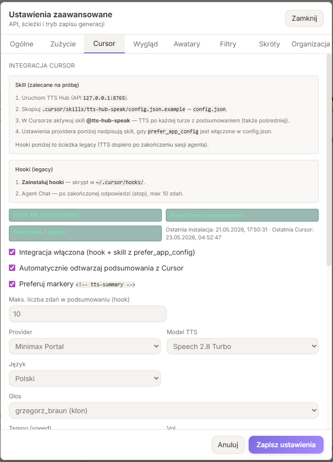

<div align="center">

# TTS Hub

**Desktopowa aplikacja do syntezy mowy (Google · MiniMax · Voice Box) z lokalnym API HTTP**

*Rdzeń aplikacji — darmowy i open source ([MIT](LICENSE)). Klucze API providerów są Twoje (BYOK).*

[](https://tauri.app/)
[](https://react.dev/)
[](https://www.rust-lang.org/)
[](https://www.typescriptlang.org/)
[](LICENSE)
[](docs/PUBLICATION_READINESS.md)

[Pobierz](#-pobierz-windows) · [Instalacja](#-szybki-start) · [Posłuchaj](#-posłuchaj-próbki) · [Funkcje](#-funkcje) · [API](#-lokalne-api-http) · [Model](#-model-i-koszty) · [Dokumentacja](#-dokumentacja)

</div>

---

<p align="center">
  
</p>

<p align="center"><em>Okno desktopowe (Tauri): providery, edytor blokowy, historia sesji i odtwarzacz z waveformem. Skórki: <strong>VIBELIFE</strong>, <strong>Matrix</strong>, <strong>Light / Zen</strong> — przełącznik w pasku tytułu.</em></p>

<p align="center">
  
</p>

---

## Czym jest TTS Hub?

TTS Hub to **natywna aplikacja desktopowa** (Tauri 2), która zamienia tekst na mowę przez **Google Gemini TTS**, **MiniMax** lub lokalny **Voice Box**, z wygodnym UI po polsku i **lokalnym serwerem HTTP** (`127.0.0.1:8765`) do skryptów, n8n, Cursora i własnych narzędzi.

> **Preview:** modele TTS Google są w fazie podglądu — wymagają klucza API z [Google AI Studio](https://aistudio.google.com/apikey). MiniMax i Voice Box mają własne wymagania — patrz [Szybka konfiguracja](docs/QUICK_SETUP.md).

---

## 🔊 Posłuchaj (próbki)

Ten sam krótki tekst w **pięciu głosach** (wygenerowane lokalnie przez TTS Hub). Kliknij link — odsłuchasz na stronie pliku w GitHubie (README nie obsługuje osadzonego `<audio>`).

| Głos | Próbka |
|------|--------|
| MiniMax — **Grzegorz Braun** (klon) | [▶ minimax-grzegorz-braun.mp3](docs/samples/minimax-grzegorz-braun.mp3) |
| MiniMax — kobieta PL | [▶ minimax-polish-female.mp3](docs/samples/minimax-polish-female.mp3) |
| MiniMax — mężczyzna PL | [▶ minimax-polish-male.mp3](docs/samples/minimax-polish-male.mp3) |
| Google — Kore | [▶ google-kore.wav](docs/samples/google-kore.wav) |
| Google — Charon | [▶ google-charon.wav](docs/samples/google-charon.wav) |

Pełna lista i regeneracja: **[docs/samples/](docs/samples/)** (`generate-readme-samples.ps1`).

---

## ✨ Funkcje

| Obszar | Opis |
|--------|------|
| **Providery** | **Google** Gemini TTS · **MiniMax** (presety + głosy sklonowane) · **Voice Box** (lokalny) |
| **Synteza** | Single-speaker lub dialog multi-speaker; opcjonalny prompt stylu |
| **Modele** | Gemini 3.1 / 2.5 Flash / Pro TTS; MiniMax speech-2.x; Voice Box profile |
| **Odtwarzanie** | Waveform z seekiem, głośnością, czasem i metadanymi generacji |
| **Historia** | Sesja (temp: bieżące + poprzednie uruchomienia, limit w ustawieniach) + archiwum trwałe; edycja tytułów |
| **Próbki głosów** | Cache lokalny; odtwarzanie i batch wszystkich głosów dla modelu |
| **Eksport** | WAV natywnie; MP3/OGG przez `ffmpeg` |
| **API** | REST na localhost — generacja, historia, audio, próbki głosów |
| **Ustawienia** | Profile API key, własne foldery, tryb zapisu ręczny/auto |
| **Szybka konfiguracja** | Kreator providerów (Google / Voice Box / MiniMax), testy połączeń, Help — [docs/QUICK_SETUP.md](docs/QUICK_SETUP.md) |
| **Filtry tekstu** | Presety: usuwanie kodu, cytatów i reguł regex; podgląd przed generacją; tryb blokowy |
| **Integracja Cursor** | Hooki Agent Chat → podsumowanie TTS (max 10 zdań) z autoplay w aplikacji |
| **Szybkie skróty TTS** | Globalne hotkeye (Windows): zaznaczony tekst w dowolnym oknie → TTS z własnym providerem/głosem/stylu |

**Skróty:** `Ctrl+Enter` — generuj · **Edycja → Szybkie skróty…** — konfiguracja globalnych hotkeyów · klik w historii (opcjonalnie) — odtwórz

---

## 📥 Pobierz (Windows)

**[Release v0.1.0 (pre-release)](https://github.com/xcwajdax/TTS_hub/releases/tag/v0.1.0)** — gotowe instalatory (x64):

| Plik | Opis |
|------|------|
| [**TTS-Hub-0.1.0-x64-setup.exe**](https://github.com/xcwajdax/TTS_hub/releases/download/v0.1.0/TTS.Hub_0.1.0_x64-setup.exe) | Instalator NSIS (zalecany) |
| [**TTS-Hub-0.1.0-x64.msi**](https://github.com/xcwajdax/TTS_hub/releases/download/v0.1.0/TTS.Hub_0.1.0_x64_en-US.msi) | Pakiet MSI |

Po instalacji: skopiuj `studios.env.example` → `%USERPROFILE%\.tts_hub\` lub użyj **Szybkiej konfiguracji** w aplikacji. Wymagany **WebView2** (Win 11 — zwykle już jest).

---

## 🚀 Szybki start

### Wymagania

| Komponent | Wersja / uwagi |
|-----------|-----------------|
| Windows 10/11 | (działa też na macOS/Linux z drobnymi różnicami ścieżek) |
| [Node.js](https://nodejs.org/) | ≥ 18 |
| [Rust](https://www.rust-lang.org/tools/install) | stable |
| WebView2 | domyślnie na Win 11 |
| **Opcjonalnie** [ffmpeg](https://ffmpeg.org/download.html) | tylko dla MP3/OGG |

### Konfiguracja

```powershell
# 1. Klucz API (nie commituj tego pliku!)
copy studios.env.example studios.env
# Edytuj studios.env:
# GOOGLE_API_KEY=AIza...
# MINIMAX_API_KEY=...          # opcjonalnie
# VOICEBOX_BASE_URL=http://127.0.0.1:17493   # opcjonalnie

# 2. Zależności
npm install
```

### Uruchomienie (dev)

```powershell
npm run tauri dev
```

Otwiera okno aplikacji i startuje API na **`http://127.0.0.1:8765`**.

Przy pierwszym uruchomieniu pojawi się baner **Szybka konfiguracja** (providery + testy API). Szczegóły: [docs/QUICK_SETUP.md](docs/QUICK_SETUP.md).

### Szybkie skróty TTS (Windows)

<p align="center">
  
</p>

<p align="center"><em>Zaznaczony tekst w dowolnym oknie (np. Notatnik) → globalny skrót → generacja w tle.</em></p>

1. **Edycja → Szybkie skróty…** (lub zakładka **Skróty** w ustawieniach ⚙).
2. Włącz master switch i skonfiguruj presety — **nagraj skrót** (np. `F9` lub `Ctrl+Alt+1`), provider, głos, styl, filtr.
3. W dowolnym oknie zaznacz tekst i naciśnij skrót — aplikacja musi działać w tle.

Przechwycenie używa symulacji **Ctrl+C** (jak ręczne kopiowanie). W terminalach lub aplikacjach bez standardowego kopiowania może nie działać.

> **Cursor Browser / zwykła przeglądarka:** adres `http://localhost:1420` to tylko frontend Vite (podgląd UI). Bez okna Tauri nie ma mostu `invoke` — używaj okna „TTS Hub” po `npm run tauri dev`. Skrypty i integracja Cursor korzystają z API na porcie **8765**, gdy aplikacja desktopowa działa.

### Build instalatora (ze źródeł)

```powershell
npm run tauri build
```

Wynik: `src-tauri/target/release/tts-hub.exe` oraz `src-tauri/target/release/bundle/` (NSIS `.exe`, MSI).

> Przed release sprawdź, że `npm run build` przechodzi — patrz [gotowość do publikacji](docs/PUBLICATION_READINESS.md).

---

## 🖥️ Interfejs

```
┌────────────────────────────────────────┬──────────────────┐
│  Ustawienia · próbki głosów · tekst    │  Sesja / Archiwum │
├────────────────────────────────────────┤  (historia)       │
│  Waveform · play · metadane generacji  │                   │
└────────────────────────────────────────┴──────────────────┘
```

- **Panel główny** — model, głos, styl, edytor tekstu, generacja.
- **Pasek odtwarzania** — waveform, tagi model/głos/format, statystyki tekstu.
- **Sidebar** — karty historii z zapisem, usuwaniem i „Pokaż w eksploratorze”.
- **Ustawienia zaawansowane** (⚙) — API, ścieżki, format zapisu.

---

## 🌐 Lokalne API HTTP

| | |
|---|---|
| **URL** | `http://127.0.0.1:8765` |
| **Auth** | brak (tylko localhost) |

```powershell
curl http://127.0.0.1:8765/health

curl -X POST http://127.0.0.1:8765/generate `
  -H "Content-Type: application/json" `
  -d '{"text":"Witaj","model":"gemini-2.5-flash-preview-tts","voice":"Kore","format":"wav"}'
```

Pełna referencja: **[docs/API.md](docs/API.md)**

---

## 💰 Model i koszty

| Warstwa | Status |
|---------|--------|
| **Aplikacja desktop + API localhost** | Darmowa — [MIT](LICENSE) |
| **Generacja mowy** | **BYOK** — płacisz bezpośrednio Google / MiniMax wg ich cennika |
| **Usługi w przyszłości (opcjonalnie)** | Sync w chmurze, presety zespołowe, hostowane funkcje — osobny produkt, nie paywall na rdzeniu |
| **Reseller kredytów API** | Rozważany na później — wymaga zgodności z ToS providerów i księgowości |

Aplikacja **nie** wysyła Twoich kluczy na nasz serwer — wszystko działa lokalnie, o ile sam nie wystawisz portu API na sieć.

---

## Integracja z Cursor (Agent Chat)

TTS Hub może czytać na głos krótkie podsumowania po polsku z odpowiedzi agenta w Cursorze.

### Skill (zalecane na próbę)

Po **każdej turze** z podsumowaniem (także pośredniej), gdy aktywujesz skill:

1. **TTS Hub uruchomiony** — API `http://127.0.0.1:8765`.
2. Skopiuj `.cursor/skills/tts-hub-speak/config.json.example` → `config.json`.
3. W Cursorze: **`@tts-hub-speak`** — agent owija podsumowanie w `<!-- tts-summary -->` i woła skrypt `speak-summary.ps1`.
4. Głos i model: ustaw w **Integracja Cursor** w aplikacji (np. klon Makłowicza); skill z `prefer_app_config: true` bierze `voice_id` stamtąd, nie z osobnego wpisu w config skillu.

Szczegóły: [docs/CURSOR_SKILL.md](docs/CURSOR_SKILL.md)

### Hooki (legacy, automatyczne)

TTS dopiero po zakończeniu sesji agenta (`stop`):

1. **PowerShell 7+** (`pwsh.exe`) na PATH.
2. **Zainstaluj hooki** — Ustawienia zaawansowane → Cursor → **Zainstaluj hooki Cursor**.
3. **Agent Chat** — hooki nie działają w Tab bez instalacji.

Log hooków: `%TEMP%\cursor-tts\cursor-tts.log` · [.cursor-hooks/README.md](.cursor-hooks/README.md)

**Nie używaj jednocześnie** skillu i hooków — podwójne odtwarzanie.

---

## 📁 Dane aplikacji

| Ścieżka (Windows) | Zawartość |
|-------------------|-----------|
| `%APPDATA%\TTS_hub\temp\` | Audio sesji |
| `%APPDATA%\TTS_hub\archive\` | Archiwum trwałe |
| `%APPDATA%\TTS_hub\history.db` | SQLite |
| `%APPDATA%\TTS_hub\voice_samples\` | Cache próbek głosów |

Reset: usuń folder `%APPDATA%\TTS_hub\`.

---

## 📚 Dokumentacja

| Plik | Opis |
|------|------|
| [docs/SPECIFICATION.md](docs/SPECIFICATION.md) | Specyfikacja produktu i wymagań |
| [docs/API.md](docs/API.md) | Referencja HTTP API |
| [docs/VOICE_WORKFLOWS.md](docs/VOICE_WORKFLOWS.md) | Profile głosu, skróty TTS, soundboard i wyjście audio |
| [docs/PROJECT_GUIDELINES.md](docs/PROJECT_GUIDELINES.md) | **Zasady pracy** (Git, kod, sekrety, AI) |
| [docs/PUBLICATION_READINESS.md](docs/PUBLICATION_READINESS.md) | Ocena gotowości do ewentualnej publikacji repo |
| [docs/screenshots/](docs/screenshots/) | Zrzuty ekranu do README i PR |
| [docs/samples/](docs/samples/) | Próbki audio do README (ten sam tekst, różne głosy) |

---

## 🏗️ Struktura projektu

```
TTS_hub/
├── studios.env.example    # szablon klucza API
├── src/                   # React + TypeScript
│   ├── components/        # UI (MainPanel, WaveformPlayer, History…)
│   ├── api/tauri.ts       # most do Rust
│   └── context/           # PlaybackContext, routing odtwarzania
├── src-tauri/             # Rust: TTS, SQLite, axum API
│   └── src/
│       ├── google.rs      # klient Gemini TTS
│       ├── voice_profiles.rs # zapisane profile TTS
│       ├── http_api.rs    # localhost:8765
│       └── db.rs          # historia
└── docs/                  # spec, API, screenshots
```

---

## ⚠️ Znane ograniczenia

- Wymaga własnego klucza **Google AI Studio** i podlega limitom/cennikowi Google.
- **MP3/OGG** — wymagany `ffmpeg` w `PATH`.
- API HTTP **bez uwierzytelnienia** — wyłącznie na tej samej maszynie.
- Sam frontend w przeglądarce (`npm run dev`) **nie** obsługuje funkcji Tauri — używaj `npm run tauri dev`.

---

## 🤝 Open source i wkład

Repozytorium jest **publiczne** na GitHubie pod licencją **[MIT](LICENSE)**. Rdzeń aplikacji pozostaje **darmowy**.

Zasady pracy (Git, sekrety, AI): **[docs/PROJECT_GUIDELINES.md](docs/PROJECT_GUIDELINES.md)**.

**Nie commituj** `studios.env` ani kluczy API. Próbki w `docs/samples/` generujesz własnymi kluczami skryptem z tego repo.

---

## 📄 Licencja

[Kod źródłowy](LICENSE) — **MIT**. Użycie komercyjne i modyfikacje dozwolone z zachowaniem informacji o licencji. Koszty API providerów (Google, MiniMax itd.) ponosisz osobno według ich regulaminów.

---

<p align="center">
  <sub>Zbudowane z Tauri · React · Rust · Google · MiniMax · Voice Box</sub>
</p>
